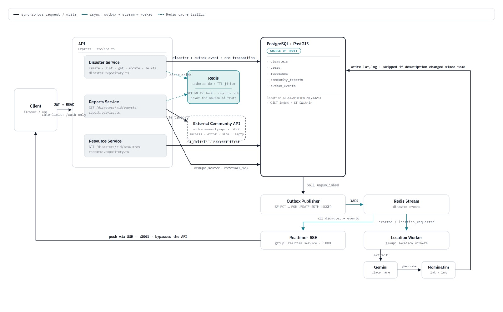

# Disaster Response Coordination Platform

Backend-first platform for recording disasters, enriching them with locations, finding nearby emergency resources, and pulling community reports from an external service, plus a React console for trying it out.


> **Core principle: the core system records reality; external services enrich it.**
> `POST /disasters` is one PostgreSQL transaction (disaster row + outbox event). Gemini, Nominatim, Redis and the community API can all be down at that moment and the disaster is still saved. Everything they add — a resolved location, cached reports — arrives afterward, asynchronously.

## Contents

[Setup and installation](#setup-and-installation) · [Architecture overview](#architecture-overview) · [Key technical decisions](#key-technical-decisions) · [Assumptions made](#assumptions-made) · [Trade-offs considered](#trade-offs-considered) · [Known limitations & future improvements](#known-limitations--areas-for-future-improvement) · [API docs & Postman](#api-documentation--postman-collection) · [Live demo](#live-demo) · [AI-assisted development](#ai-assisted-development)

---

## Setup and installation

Needs **Node 20+** and **Docker Desktop** (for PostgreSQL + PostGIS and Redis). A **Gemini API key** is only needed for automatic location resolution — everything else works without one.

```bash
git clone https://github.com/Srinidhi444/Disaster-Management
cd disaster-sri
cp .env.example .env     # then set GEMINI_API_KEY (and a distinctive NOMINATIM_USER_AGENT — see note below)
npm install
npm run setup            # installs frontend deps, starts Postgres+Redis in Docker, runs migrations, seeds data
npm run dev               # API, outbox publisher, location worker, realtime service, mock community API, frontend
```

Then open:

| URL | What |
|---|---|
| http://localhost:5173 | Web console (sign in with a seeded account below) |
| http://localhost:3000/docs | Swagger UI |
| http://localhost:3000/health | Health check |
| http://localhost:3001/events/disasters | Server-Sent Events stream |
| http://localhost:4000/external/community-reports?query=Manhattan | Mock external service |

**Seeded accounts:** `admin@example.com / Admin1234!` (ADMIN) and `contributor@example.com / Contributor1234!` (CONTRIBUTOR).

Notes:
- `npm run dev` runs six processes with colour-coded log prefixes; Ctrl+C stops them all. Without `GEMINI_API_KEY` only the location worker refuses to start (with a clear error); new incidents then simply stay `PENDING`.
- Nominatim's usage policy rejects generic/placeholder User-Agents with HTTP 403. Set `NOMINATIM_USER_AGENT` in `.env` to something that identifies your app.
- Ports 3000, 3001, 4000, 5173, 5432 and 6379 must be free. If you previously ran the full Docker stack, stop it first with `docker compose down`.
- `npm run setup` and `npm run seed` are idempotent and safe to re-run.

**Alternative: run the whole backend in Docker, frontend separately**

```bash
cp .env.example .env
docker compose up --build                 # postgres+postgis, redis, migrate (one-shot), api, workers, realtime, mock API
docker compose exec api npm run seed
cd frontend && npm install && npm run dev  # console on http://localhost:5173
```

**Tests** need no Docker, database, Redis or API keys: `npm test` (and `npm run typecheck`).

### Environment variables

See [.env.example](.env.example) (backend) and [frontend/.env.example](frontend/.env.example). Required: `DATABASE_URL`, `JWT_SECRET` (≥16 characters, validated at startup). The location worker additionally needs `GEMINI_API_KEY`. Cache TTLs: `CACHE_DISASTER_TTL_SECONDS`, `CACHE_REPORTS_TTL_SECONDS`. Timeouts/retries: `EXTERNAL_API_TIMEOUT_MS`, `LOCATION_MAX_RETRIES`, `LOCATION_RETRY_BASE_MS`. `COMMUNITY_API_SCENARIO=error|slow|empty` forces a mock failure mode for testing.

---

## Architecture overview





The system is a **modular monolith with background workers**, not a microservice mesh: one codebase, five backend processes, plus PostgreSQL and Redis as infrastructure. Each process is a plain `npm run` script, so the whole thing can run as separate `node` processes locally or as separate containers in Docker Compose — the code doesn't change either way.

| Process | Owns | Talks to |
|---|---|---|
| **API** (`src/server.ts`, :3000) | HTTP, auth, validation, CRUD, cache reads, writing outbox rows, Swagger docs | Postgres, Redis, the mock community API |
| **Outbox Publisher** (`workers/outbox-publisher.ts`) | Moving committed database changes onto the event stream | Postgres (reads), Redis Streams (writes) |
| **Location Worker** (`workers/location-worker.ts`) | Turning a disaster's free-text description into coordinates | Redis Streams (consumes), Gemini, Nominatim, Postgres |
| **Realtime / SSE** (`workers/realtime-worker.ts`, :3001) | Pushing live updates to connected browsers | Redis Streams (consumes), client connections |
| **Mock Community API** (`mock-community-api/`, :4000) | Standing in for a real external social/community-reports vendor | Nothing — it's a deliberately isolated, separately-run service |
| **PostgreSQL + PostGIS** | The one place any of this data is authoritative | Everything reads/writes here eventually |
| **Redis** | Cache, short-lived locks, the event stream | Never holds data nothing else has a copy of |

Each backend module follows the same shape: `routes` (HTTP only) → `service` (business rules, the only place authorization decisions and cross-cutting concerns live) → `repository` (SQL). External systems — the LLM, the geocoder, the community API, the cache — are each behind a small interface (`LocationExtractor`, `Geocoder`, `CommunityReportsProvider`, `Cache`), so the service layer never imports a vendor SDK directly and every test can swap in a fake instead of calling a real network.

### Gemini ≠ geocoder ≠ PostGIS

These three are easy to conflate and the system depends on them staying separate:

| | Responsibility |
|---|---|
| **Gemini 2.5 Flash** | Reads free text and extracts the place **name** as a string (`"Manhattan, NYC"`), or returns `null` if it can't find one. It never produces coordinates — LLMs hallucinate numbers, so coordinates are never something an LLM is trusted to output here. |
| **Nominatim (OpenStreetMap)** | Takes that place name and turns it into latitude/longitude. It's the only component that does geocoding, and it's reached through a `Geocoder` interface so it can be swapped for Google Maps, Mapbox, or HERE without touching the worker's logic. |
| **PostGIS** | Stores the resulting point as `GEOGRAPHY(POINT, 4326)` and answers every "what's nearby" question with real spatial SQL (`ST_DWithin`, `ST_Distance`) inside the database — never by pulling rows into Node and computing distance in application code. |

### Request lifecycle: creating a disaster

`POST /disasters` does the minimum possible amount of work before returning: authenticate the JWT, authorize the role, validate the body with Zod, then **one** database transaction that inserts the disaster row (`location_status = PENDING`) and a matching `disaster.created` row in `outbox_events`. That transaction commits, the API returns `201`, and the request is done — nothing above has called Gemini, Nominatim, or touched Redis for anything other than invalidating list caches.

Separately and continuously, the Outbox Publisher polls `outbox_events` for unpublished rows (`SELECT … FOR UPDATE SKIP LOCKED`, so more than one publisher instance can run safely) and `XADD`s each one onto the `disaster-events` Redis Stream, then marks it published. Two independent consumer groups read that same stream: `location-workers` and `realtime-service`. The Location Worker picks up `disaster.created`, asks Gemini for a place name, asks Nominatim for coordinates, and writes the result back to Postgres in its own transaction — guarded so a delivery that arrives twice, or a resolution that's still in flight when the description changes again, can never overwrite a newer state (see **Idempotency** below). The Realtime service picks up every `disaster.*` event and pushes it straight to connected browsers over SSE, bypassing the API entirely.

Editing a disaster's **description** re-enters this same pipeline: the update transaction clears the existing location, resets `location_status` to `PENDING`, and writes a new `disaster.location_requested` outbox row alongside the usual `disaster.updated` one — because a corrected or retyped place name means the old coordinates are now wrong. Editing anything else (title, tags, status) leaves the location untouched.

### Location resolution pipeline

1. Worker loads the disaster by id. If it isn't `PENDING`, it stops — this makes duplicate `disaster.created`/`disaster.location_requested` deliveries a no-op.
2. **Gemini** (structured JSON output, temperature 0, a system prompt that explicitly forbids inventing a place or emitting coordinates) returns `{"location": "Manhattan, NYC"}` or `{"location": null}`.
3. **Nominatim** geocodes that string; the response is validated to be well-formed and in-range before being trusted.
4. In one transaction: `location`, `location_text`, `location_status = RESOLVED`, and a `disaster.location_resolved` outbox row are all written together, and the relevant Redis cache keys are invalidated.

**Retries.** A provider error (timeout, 5xx, malformed response) retries with exponential backoff (`base · 2^n`: 1s, 2s, 4s…) up to `LOCATION_MAX_RETRIES`, then the disaster is marked `FAILED` with the reason recorded. The attempt counter lives in the database row, so it survives a worker restart. "Gemini found no location in the text" and "Nominatim found no match" are both deterministic outcomes, so they go straight to `FAILED` without retrying — retrying a request that will always fail the same way just delays the honest answer. If the worker crashes mid-message, the stream message stays in the consumer group's pending list and is reclaimed by another consumer (`XAUTOCLAIM`) after an idle timeout.

### Redis: cache, locks, event stream — never the source of truth

- **Cache-aside** for the disaster list (key includes every filter, alphabetized, so query-parameter order never produces a second cache entry), disaster detail, and community reports. Every key carries a TTL; nothing is cached forever.
- **TTL jitter:** the stored TTL is the base value plus a small random extra, so keys written around the same time don't all expire in the same instant and stampede the database together.
- **Invalidation is explicit**, not time-based guessing: create, update, delete, and location resolution each delete the specific detail key and the whole list-cache prefix.
- **Request coalescing** exists in exactly one place: community reports. A cache miss there means a real outbound HTTP call to an external service, so the first request to miss takes a short `SET NX EX` lock and makes that call; everything else arriving during the same window polls the cache briefly instead of firing its own request. Reading a disaster by id is a single indexed Postgres row lookup — cheap enough that it's plain cache-aside with no lock at all.
- **Redis is never required for a read to succeed.** Every cache call swallows its own errors and uses a fail-fast client (no offline queue, a short command timeout), so a dead Redis degrades straight to PostgreSQL (or, for reports, straight to the external API) instead of the request hanging. `/health` reports this as `degraded` rather than `down`.

### Community reports & external-service failure handling

`GET /disasters/:id/reports` is cache-aside with the coalescing lock described above, and one more layer: alongside the normal TTL cache entry, a longer-lived "stale" copy is kept. If the external service is down when a refresh is attempted, the response falls back to that stale copy (marked `meta.stale: true`) rather than failing outright; only if there's no cached copy at all does the endpoint return `503` with a plain error message. Every successful fetch is also normalized and persisted into `community_reports`, deduplicated on `(source, external_id)`, so Postgres holds its own durable copy of external data rather than treating the cache as the only record of it. The mock service supports `?scenario=success|error|slow|empty` specifically so this failure handling can be exercised on demand.

### Transactional outbox, Redis Streams, and realtime SSE

The core problem the outbox solves: if a request handler wrote a disaster to Postgres and then published an event to Redis as two separate steps, a crash or a dropped connection between those two steps would leave a disaster with no corresponding event — and nothing downstream would ever know it existed. Writing the outbox row in the **same transaction** as the business write makes that failure mode impossible: either both commit, or neither does.

Redis **Streams**, not Redis Pub/Sub, carry that outbox onto the wire, specifically because Pub/Sub simply drops a message if no one happens to be subscribed at that instant. Streams persist messages, support named consumer groups with independent read positions, require an explicit acknowledgement before a message is considered handled, and let a crashed consumer's unacknowledged messages be reclaimed by another. Delivery is **at-least-once** end to end (a crash between `XADD` and marking the outbox row published would republish it), so every consumer is written to be safe against processing the same event twice — the outbox row's own id serves as the idempotency key.

SSE was chosen over WebSockets because the traffic in this system is one-directional — server to client only — and SSE gets that for free: a plain HTTP response with the right headers, automatic browser reconnection, and no separate protocol upgrade to manage. The realtime service keeps its own set of open connections, sends a heartbeat comment every 15 seconds to keep proxies from timing the connection out, and cleans up on disconnect.

### Idempotency

The location worker only acts on disasters whose `location_status` is `PENDING`, and the update that resolves a location is itself guarded (`WHERE location_status <> 'RESOLVED' AND description = $n`) — so a duplicate event delivery, or a resolution that's still running when the description gets edited again, can never re-run Gemini needlessly or overwrite a newer edit with a stale answer. Community reports rely on the database's own `UNIQUE(source, external_id)` constraint rather than any application-level check. The outbox's unique event id is the idempotency key everywhere else. None of this required a general-purpose deduplication framework — each case is handled at the one point where it actually matters.

### Frontend (web console)

A dark-first React console in [frontend/](frontend/) exercises every backend feature end to end: Vite, React + TypeScript, Tailwind CSS 4, React Router, TanStack Query, native `EventSource` for the live feed, React Leaflet for the map, Zod for client-side validation, Lucide icons. It isn't a requirement of the assignment — it exists so the API doesn't have to be exercised purely through curl or Postman.

- **Dashboard (`/`):** incident stats, a map of located incidents, tag/status filters, a live activity feed, a "report incident" form.
- **Incident detail (`/disasters/:id`):** location-resolution status (a progress state while `PENDING`, the reason and attempt count if `FAILED`), a map with a nearby-resources radius search (type filter, click anywhere to search around a different point), a community-reports tab (Live / Cached / Stale badge, visible `503` handling), edit and delete.
- **Realtime:** a single `EventSource` shared by the whole app, with a Live / Reconnecting / Offline indicator; rows flash and lists refresh automatically as events arrive.
- **Permissions in the UI mirror the API's rules** (owner or admin can edit, only admin can delete, everyone else sees a read-only state) — but the UI hiding a button is a convenience, not the enforcement; the API rejects the same action regardless of what the UI shows.

### Testing

`npm test` runs 51 tests, entirely offline: the real Express app with in-memory repositories, cache, and provider fakes injected in place of Postgres, Redis, Gemini, and Nominatim, plus the real HTTP community-reports provider tested against the real mock service on an ephemeral port. Coverage spans the required categories and more: an authenticated create-and-verify-outbox-row flow, validation failures, the contributor-ownership business rule (and the admin override), external-integration success/failure/timeout/dedup, and the location worker's retry/backoff/idempotency behaviour including the "stale result discarded" race.

Beyond the automated suite, the full stack has been run for real against Docker-hosted PostgreSQL + PostGIS and Redis, with the real Gemini API and the real Nominatim endpoint: a created disaster reliably reaches `RESOLVED` with correct coordinates within a few seconds, nearby-resource search returns real distance-sorted results, and the retry-then-`FAILED` path was observed directly when Nominatim rejected a placeholder User-Agent. What hasn't been exercised against live infrastructure — a Redis-down or Postgres-down request path beyond an initial boot check, a worker crash and stream reclaim, multiple outbox publishers running concurrently — is covered instead by the offline test suite. See [REPORT.md](REPORT.md) for the full test-by-test inventory and the detailed record of that live run.

---

## Key technical decisions

- **Transactional outbox over "write, then publish."** A disaster (or an update) and its event are written in the same Postgres transaction, so the two can never disagree about what happened.
- **Redis Streams, not Pub/Sub, as the event bus.** Pub/Sub drops messages for absent subscribers; Streams persist them, support consumer groups, and support reclaiming an unacknowledged message.
- **Gemini extracts text; it never produces coordinates.** Coordinates always come from a real geocoder, behind a `Geocoder` interface, so the geocoding provider can be swapped without touching the worker.
- **Cache-aside everywhere, but request coalescing only where a miss is expensive** (community reports, which cost a real outbound HTTP call) — not on every cached read.
- **Authentication and authorization are two separate concerns.** JWT verification is middleware; the "a contributor may only edit their own disaster" rule lives in the service layer and reads ownership from Postgres, never from a cached copy, so it can't act on stale data.
- **SSE, not WebSockets**, because the realtime requirement here is one-directional (server → client) and SSE gets reconnection and simplicity for free.
- **Editing a disaster's description re-triggers location resolution**, guarded by an equality check against the exact description text a worker read, so an in-flight resolution based on an old description can never clobber a newer edit.
- **Raw parameterized SQL for spatial queries**, not an ORM's query builder — PostGIS operators like `ST_DWithin` don't map cleanly onto most ORMs, and hiding them behind one would cost correctness for no real gain here.
- **Every disaster write is one transaction**; nothing about disaster creation depends on Gemini, Nominatim, or the community API being reachable at that moment.

## Assumptions made

- A disaster has exactly one representative point location, not a region or polygon — good enough for "nearby resources within N km," which is what the assignment asks for.
- `community_reports.external_id` is unique per `source`, matching the assignment's specification; the mock service is built to honor that by construction.
- CONTRIBUTOR accounts represent trusted individuals (e.g. verified responders) rather than the general public — there's no email verification, approval queue, or moderation step, consistent with the assignment's explicit instruction to keep authentication lightweight.
- A single Nominatim endpoint and a single Gemini model are sufficient for this scope; a production deployment would likely need a paid geocoding provider with a real SLA, but swapping one in doesn't require touching anything outside `src/providers/nominatim.ts`.
- The location worker should degrade, not crash, if `GEMINI_API_KEY` is missing — new disasters simply stay `PENDING` rather than taking down a process other services depend on.
- A single PostgreSQL instance and a single Redis instance are adequate for the expected review/demo load; nothing in the design assumes read replicas or clustering.
- Emergency resources (shelters, hospitals, etc.) are relatively static reference data that gets seeded ahead of time — there's no create/update/delete API for them, because the assignment only asks for reading nearby ones.
- "Nearby" means geodesic straight-line distance via PostGIS `geography`, not real travel/road distance.
- The web console is a reviewer-facing testing tool, not a production public UI — it doesn't need things like a CSRF-safe cookie flow, a full accessibility audit, or internationalization.

## Trade-offs considered

- **Redis Streams instead of Kafka.** Redis is already required for caching; Streams provide persistence, consumer groups, acknowledgement, and reclaim without adding a second piece of infrastructure to operate. Kafka would be the right call at much higher event volume, longer retention requirements, or many more independent consumers than this system has.
- **`pg` with hand-written SQL migrations, instead of Prisma.** The columns that matter most (`GEOGRAPHY(POINT,4326)`) aren't cleanly representable in Prisma's schema language, and every spatial query needed raw SQL regardless — so adding an ORM would have meant maintaining two query styles for no benefit.
- **A single realtime process/consumer group.** Running a second instance of the realtime service today would split the stream between them (each instance only sees a subset of events), not duplicate the full feed to both — scaling SSE out safely would need each instance to use its own consumer group, or a fan-out layer in front of them. Out of scope for this size of project.
- **Retries run serially inside the location worker** (concurrency of one, with backoff blocking that one worker) rather than in parallel. This is simple, and matches Nominatim's own ~1 request/second usage policy, but means a single slow retry delays every disaster behind it in the queue.
- **No dead-letter stream.** A message that keeps failing for a reason other than a normal provider error (a bug, not a timeout) would be redelivered indefinitely rather than being parked for manual inspection after N attempts — accepted for this scope, flagged as the first thing to add before this ran unattended in production.
- **Reports are deduplicated globally on `(source, external_id)`**, exactly as specified, so the same external report id can only ever be attached to one disaster — a deliberate reading of the spec rather than a limitation discovered by accident.
- **`tsx` runs TypeScript directly inside containers**, instead of compiling to `dist/` first — faster to develop against, at the cost of a slightly heavier runtime than a compiled production image would have.

## Known limitations & areas for future improvement

- **No dead-letter queue** for location-resolution messages that fail for unexpected reasons; today they simply keep retrying via stream redelivery.
- **No horizontal scaling path for the realtime SSE service** beyond one instance per consumer group, as described under Trade-offs above.
- **Rate limiting only covers `/auth/register` and `/auth/login`.** Public read endpoints (`GET /disasters`, `/resources`, `/reports`) have no request throttling of their own.
- **No refresh tokens or session revocation** — a JWT is valid until `JWT_EXPIRES_IN` elapses; there's no logout-everywhere or token blacklist.
- **No resource-management API.** Emergency resources are seed-data only; there's no endpoint to create, update, or remove one.
- **`GET /disasters` uses offset/limit pagination**, which is simple but degrades at large offsets; a cursor-based approach would scale better.
- **No full-text search** on title or description — filtering is limited to exact tag and status matches.
- **No metrics, tracing, or alerting** beyond structured JSON logs; there's nothing wired up to page anyone if the location worker's failure rate spikes.
- **The frontend has no automated tests**; only the backend's 51 tests run in CI-style fashion.
- **A disaster models one point, not a region** — a disaster genuinely spanning a wide area is still represented as a single coordinate.
- **Nominatim's public instance is rate-limited to roughly one request per second**, which is fine for a demo but not for production volume; swapping in a paid provider only touches `src/providers/nominatim.ts`.

---

## API documentation & Postman collection

- **Swagger UI:** http://localhost:3000/docs while the API is running (also served as raw JSON at `/openapi.json`).
- **Static OpenAPI export:** [docs/openapi.json](docs/openapi.json) — regenerate with `npm run docs:openapi`.
- **Postman collection:** [docs/postman_collection.json](docs/postman_collection.json) — import it directly; it stores the auth token and the created disaster's id in collection variables automatically, so requests can be run top to bottom without manual copy-pasting. It was verified end to end with Newman: 18 requests, 15 assertions, 0 failures.

## Live demo

There's no hosted live deployment — the project is designed to be run locally with Docker (see **Setup and installation** above), since it depends on infrastructure (PostgreSQL/PostGIS, Redis, an LLM API key) that doesn't have a meaningful always-on free hosting story for a take-home.

**If you're not able to clone and run it locally, watch the recorded walkthrough instead:** [Demo video](ADD-YOUR-DEMO-VIDEO-LINK-HERE)
## AI-assisted development

AI tools were used extensively throughout the development of this project.

GPT was used during the initial architecture and design discussions, while Claude was used extensively for implementation, testing, and documentation.

I directed the architecture, product requirements, priorities, trade-offs, and implementation decisions throughout the project. This included decisions such as re-running location resolution when a disaster description is edited, the frontend visual design, the event-driven architecture, and which features to prioritize within the assignment scope.

I reviewed and tested the generated implementation rather than relying solely on generated output. I ran the complete system end to end against the actual Docker-hosted infrastructure, tested both the API and web console, and fixed issues discovered during integration testing, including a PostgreSQL healthcheck race during initial container setup and a Nominatim User-Agent configuration issue.

AI was also used to cross-check the architecture against the implementation. This helped identify discrepancies between an initial hand-drawn architecture diagram and the actual source code, which were then corrected.

The majority of the implementation was AI-assisted. My role was primarily to define the system, make the engineering decisions, review the implementation, test it against real infrastructure, and iterate on issues discovered during development.
